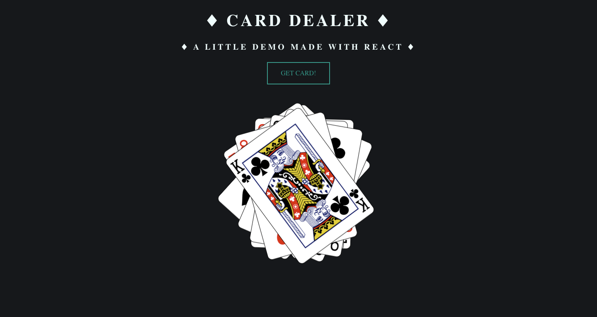

# Card Dealer

[Card Dealer](https://carddealer.netlify.com/) is a card dealing app built as an exercise for this [tutorial](https://www.udemy.com/course/modern-react-bootcamp/).



## Table of content

- [Project Specifications](#Specifications)
- [Installation](#installation)
- [Contact](#contact)

## Specifications

Build an app that displays a deck of cards, one card at a time. When the page loads, send a request to https://deckofcardsapi.com/api/deck/new/shuffle to create a new deck. Store the Deck ID it gives you, so you can make further requests to retreive each card image. Add a button to your app that allows a user to draw a new card.

When a user clicks the button, send another request to the API, this time to https://deckofcardsapi.com/api/deck/${deck_id}/draw/. (make sure to use your actual deck ID). Use the data included in the response to display a new card image, and make sure to include an informative alt attribute.

Every time the user clicks, the app should display a new card until the deck is empty. Make sure to tell the user there are no cards left!

## Installation

1. Clone the project to your local directory

```
git clone https://github.com/KaushikShivam/card_dealer
```

2. The project uses NPM for managing dependencies. Run npm install to install all the required dependencies

```
npm install
```

3. Run the task runner to run the app

```
npm run start
```

## Contact

You can contact me at:

- [Portfolio](https://www.shivamkaushik.com)
- [Email](mailto:shivamkaushikofficial@gmail.com)
- [Linkedin](https://www.linkedin.com/in/kshivamdev/)
- [Twitter](https://twitter.com/kShivamDev)
- [Medium](https://medium.com/@shivamkaushikofficial)
- [Angellist](https://angel.co/kshivamdev)
